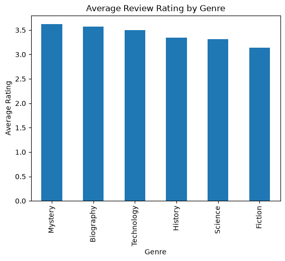

# Project Documentation

> Use this hosted documentation site to tell your
> data story. Include a narrative telling your
> results, observations, and interpretations.
> Display visuals as needed for a compelling story.
>

## Documentation Index

- **Home** - this landing page
- [**Project Instructions**](./project-instructions.md)
- [**Concepts**](./concepts.md)
- [**Data Card**](./data-card.md)
- [**API**](./api.md)

## Library Genre Rating Analysis

This project analyzes average book review ratings by genre using related
library data.

The analysis uses two related tables:

- the **books** table, which contains each book's genre
- the **reviews** table, which contains review ratings

The tables are connected using `book_id`.

The goal of the analysis was to compare the average review rating for each
book genre.

### Results

The average review ratings were:

- Mystery: 3.62
- Biography: 3.57
- Technology: 3.50
- History: 3.34
- Science: 3.31
- Fiction: 3.14

Mystery had the highest average review rating at 3.62, while Fiction had the
lowest average rating at 3.14.

Overall, the average ratings were fairly close across all six genres.

### Interpretation

The results suggest that genre may have some relationship with average review
ratings, although the differences between genres are relatively small.

A useful next step would be to explore whether the number of reviews or the
length of the books is related to the ratings.

## Produced Artifacts

This project produces the same results in several useful forms.

- [**Reactive App (marimo)**](https://lindsaymiller1807.github.io/datafun-05-sql/app/)
  - run the analysis interactively in a browser
